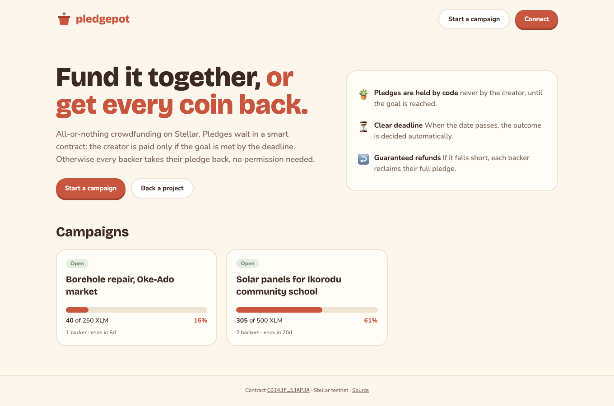

# Pledgepot

**All-or-nothing crowdfunding on Stellar. Backers get refunds, guaranteed by code.**

Pledgepot is a Soroban contract for community fundraising: a school
roof, solar panels for a co-op, an indie game, a neighbourhood
borehole. A creator sets a goal, an asset and a deadline. Backers pledge
into the contract, never to the creator directly. When the deadline
passes:

| Outcome | What happens |
| --- | --- |
| **Goal met** (overfunding allowed) | The creator claims everything, once |
| **Goal missed** | Every backer takes back exactly what they pledged |
| **Creator cancels early** | Refunds open immediately |

There's no way for a creator to walk away with a half-funded campaign,
and no backer's refund depends on the creator doing anything.

## Lifecycle

```text
            pledge / unpledge
   ┌────────────────────────────┐
   ▼                            │
 Open ──deadline, pledged ≥ goal──▶ Succeeded ──claim──▶ Claimed
   │
   ├─deadline, pledged < goal──▶ Failed ──refund (each backer)
   └─cancel────────────────────▶ Failed
```

State is computed from the clock and the totals, so nobody has to
"finalize" a campaign. It's always exactly one of these.

## Contract interface

| Function | Who signs | Notes |
| --- | --- | --- |
| `create_campaign(creator, token, goal, deadline, title)` | creator | Title ≤ 100 chars |
| `pledge(campaign_id, backer, amount)` | backer | While open; pledges add up |
| `unpledge(campaign_id, backer, amount)` | backer | While open; partial or full |
| `claim(campaign_id)` | creator | Succeeded only, once |
| `refund(campaign_id, backer)` | backer | Failed/cancelled only, once |
| `cancel(campaign_id)` | creator | While open |
| `state`, `get_campaign`, `pledge_of` | anyone | Read state |

Errors: `CampaignNotFound (1)`, `InvalidCampaign (2)`, `InvalidAmount (3)`,
`NotOpen (4)`, `NotSucceeded (5)`, `NotFailed (6)`, `NothingPledged (7)`,
`TitleTooLong (8)`.

Events (topics → data): `("pot","created")`, `("pot","pledged", id)`,
`("pot","unpledged", id)`, `("pot","claimed", id)`, `("pot","refunded", id)`,
`("pot","cancelled")`.

## Build, test and deploy

```bash
cd contracts
cargo test             # 12 unit tests
stellar contract build
stellar contract deploy --wasm target/wasm32v1-none/release/pledgepot.wasm \
  --source me --network testnet

stellar contract invoke --id <POT> --source me --network testnet -- \
  create_campaign --creator me --token <USDC_SAC_ID> --goal 50000000000 \
  --deadline 1769904000 --title "Community solar panels"
```

## Web app



A crowdfunding site at `web/`:

- **Campaign gallery** with funding progress, backer counts and time left, all read live from the contract.
- **Campaign page**: back it with one-tap amounts, withdraw your pledge while it's open, and see your own pledge.
- **Outcome-aware actions**: the creator claims after a successful campaign; backers get a one-click refund after a failed or cancelled one; the creator can cancel early.
- **Start a campaign**: title, goal, duration and asset, with a plain-language explanation of all-or-nothing rules.

```bash
cd web
npm install
npm run dev        # http://localhost:5173
```

It talks to the contract deployed on **Stellar testnet** and signs with
[Freighter](https://www.freighter.app) (switch it to Testnet). Point it at
another deployment with `VITE_CONTRACT_ID` (see `web/.env.example`).
`netlify.toml` at the repo root deploys it as-is.

## Documentation

- [Architecture](docs/architecture.md)
- [Running a campaign](docs/running-a-campaign.md)
- [Contributing](CONTRIBUTING.md) · [Security policy](SECURITY.md) · [Changelog](CHANGELOG.md)

## Glossary (new to Stellar?)

- **All-or-nothing**: the creator only receives money if the goal is
  reached, so backers never fund a project that can't happen.
- **Pledge**: tokens a backer commits to a campaign. Here they sit in the
  contract until the outcome is known.
- **Refund**: the backer pulls their own pledge back after a failed or
  cancelled campaign. No one has to approve it.
- **Soroban / SAC**: Stellar's smart-contract platform / the contract
  address representing a Stellar asset such as XLM or USDC.
- **Ledger timestamp**: the network's clock, which the deadline is
  measured against.

## License

MIT
